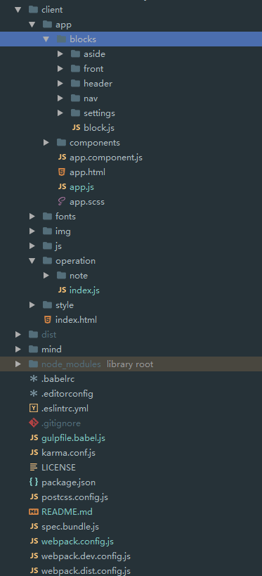

# webpack2-angular1-es6-lazyload

### 注意：
  1. 使用的UI样式并不是开源的
  2. 项目改变了NG6-starter配置
      1. 升级了依赖包括webpack之类
      2. 修改了babel的配置及webpack的配置
      3. 去掉了不需要的东西
      4. 加入了懒加载，但是是基于组件的懒加载

### 在此项目爬过的坑
  1. 升级了webpack2.0之后，webpack2.0默认支持 ``es6 module``，  
     但如果禁掉了``babel``的module，  
     会导致``ng-annotate-loader``执行无效,  
     并且写的时候需要给函数内部加上 **'ngInject'**,  
     以让``ng-annotate-loader``注入依赖
  
  2. 在debug webpack时可以借助``webstorm``对``gulp``debug的支持，  
    将webpack当做gulp的task用
    
  3. 项目目录图
        * app放UI组件
        * operation里面放业务组件
        * 入口为app.js  
        
        
  4. 在做懒加载的时候